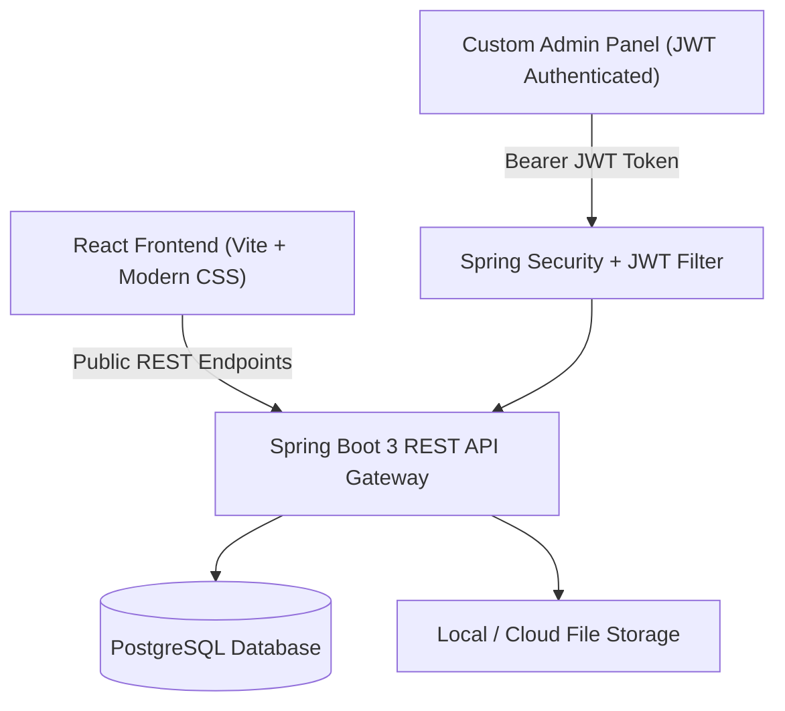

# Portfolio Project with Custom CMS

A full-stack, production-grade Developer Portfolio and Content Management System (CMS) designed for modern software engineers. It features an interactive, cyber-aesthetic portfolio frontend with an integrated custom Admin CMS panel, powered by a robust Java Spring Boot REST backend with PostgreSQL and JWT authentication.

---

## 🚀 Architecture Overview



- **Frontend**: React (Vite), modern responsive CSS, Lucide icons, interactive CMS modal & live state updates
- **Backend**: Java 17+, Spring Boot 3.3.4, Spring Data JPA, Spring Security, JJWT
- **Database**: PostgreSQL (with automatic schema migration & H2 fallback for testing)
- **Security**: Stateless JWT (JSON Web Token) authentication with BCrypt password hashing & CORS protection
- **CMS Modules**: Projects, Skills, Experience, Blogs, Testimonials, Services, Image/File Uploads, Contact Inquiries

---

## ✨ Features

- **Public Portfolio**:
  - Hero introduction with developer spotlight & credentials
  - Tech stack skill grid
  - Interactive project showcase with direct repository links
  - Work experience & internships timeline
  - Engineering & freelance services section
  - Live Contact Form with instant submission feedback and CMS message inbox delivery
- **Custom Admin CMS**:
  - Secure admin login with JWT authentication
  - Add, edit, and delete **Projects**
  - Add and remove **Skills** with categorization
  - Manage **Experience** entries and timelines
  - Publish, edit, and remove **Blog** posts
  - Manage **Client Testimonials**
  - Manage **Services** offerings
  - Upload images and documents
  - View incoming **Contact Messages** and inquiries

---

## 📁 Project Structure

```
portfolio-cms/
├── .env.example              # Sample environment configuration
├── .gitignore                # Production ignore rules for Node & Java
├── README.md                 # Project documentation
│
├── frontend/                 # React UI + Custom Admin CMS
│   ├── index.html            # HTML entry
│   ├── package.json          # Dependencies & scripts
│   ├── vite.config.js        # Vite configuration
│   └── src/
│       ├── main.jsx          # Public portfolio & CMS admin app
│       └── style.css         # Cyber-dark theme styles & responsive design
│
└── backend/                  # Spring Boot 3 REST API
    ├── pom.xml               # Maven dependencies (JPA, Security, JWT, PostgreSQL)
    └── src/main/
        ├── java/com/portfolio/
        │   ├── PortfolioApplication.java # Spring Boot main & DB seeder
        │   ├── controller/               # REST API Controllers
        │   ├── model/                    # JPA Entities & DTOs
        │   ├── repository/               # Spring Data Repositories
        │   └── security/                 # JWT Utility, Filter & SecurityConfig
        └── resources/
            └── application.properties    # PostgreSQL, JWT, and CORS properties
```

---

## 🛠️ Getting Started

### Prerequisites

- **Node.js**: v18+ (tested on Node v24)
- **Java JDK**: 17+ (tested on Java 25)
- **PostgreSQL**: v13+ (or default local instance)
- **Git**

---

### 1. Environment Configuration

Copy the example environment file:

```bash
cp .env.example .env
```

Update your database credentials, server port, and JWT secret key in `.env`.

---

### 2. Frontend Setup & Launch

```bash
cd frontend
npm install
npm run dev
```

The frontend will start at `http://localhost:3000/`.

To build for production:

```bash
npm run build
```

---

### 3. Backend Setup & Launch

Make sure PostgreSQL is running and create the database:

```sql
CREATE DATABASE portfolio_db;
```

Navigate to the `backend` folder and run with Maven:

```bash
cd backend
mvn spring-boot:run
```

The backend REST API will start on `http://localhost:8080/`.

---

## 🔐 Admin CMS Credentials

On initial application startup, default demo admin credentials are seeded:

- **Username**: `admin`
- **Password**: `admin123`

*(You can customize these via `DEFAULT_ADMIN_USERNAME` and `DEFAULT_ADMIN_PASSWORD` in `.env`)*

---

## 📡 REST API Reference

| Method | Endpoint | Access | Description |
| :--- | :--- | :--- | :--- |
| `POST` | `/api/auth/login` | Public | Authenticate admin & obtain JWT token |
| `GET` | `/api/projects` | Public | Retrieve all portfolio projects |
| `POST` | `/api/projects` | Admin | Create a new project |
| `PUT` | `/api/projects/{id}` | Admin | Update an existing project |
| `DELETE` | `/api/projects/{id}` | Admin | Delete a project |
| `GET` | `/api/skills` | Public | Retrieve all skills |
| `POST` | `/api/skills` | Admin | Add a new skill |
| `DELETE` | `/api/skills/{id}` | Admin | Delete a skill |
| `GET` | `/api/experience` | Public | Retrieve experience timeline |
| `POST` | `/api/experience` | Admin | Add experience entry |
| `DELETE` | `/api/experience/{id}` | Admin | Delete experience entry |
| `GET` | `/api/blogs` | Public | Retrieve published blog posts |
| `POST` | `/api/blogs` | Admin | Publish a new blog post |
| `DELETE` | `/api/blogs/{id}` | Admin | Remove a blog post |
| `GET` | `/api/services` | Public | List services offered |
| `POST` | `/api/contact` | Public | Submit contact form inquiry |
| `GET` | `/api/contact` | Admin | View all submitted inquiries |
| `POST` | `/api/files/upload` | Admin | Upload images and documents |

---

## 🛡️ Security Best Practices

- **Stateless Authentication**: Sessions are managed purely via signed JSON Web Tokens (HS256).
- **Password Hashing**: Passwords stored using Spring Security's `BCryptPasswordEncoder`.
- **Environment Isolation**: Sensitive credentials and secrets are managed via environment variables and excluded by `.gitignore`.
- **CORS Configuration**: Restricts API calls strictly to approved frontend client origins.

---

## 👤 Author

**Kelli Balaji**
- **GitHub**: [@KelliBalaji7](https://github.com/KelliBalaji7)
- **Email**: [balajikelli789@gmail.com](mailto:balajikelli789@gmail.com)

---

## 📄 License

This project is licensed under the MIT License.
